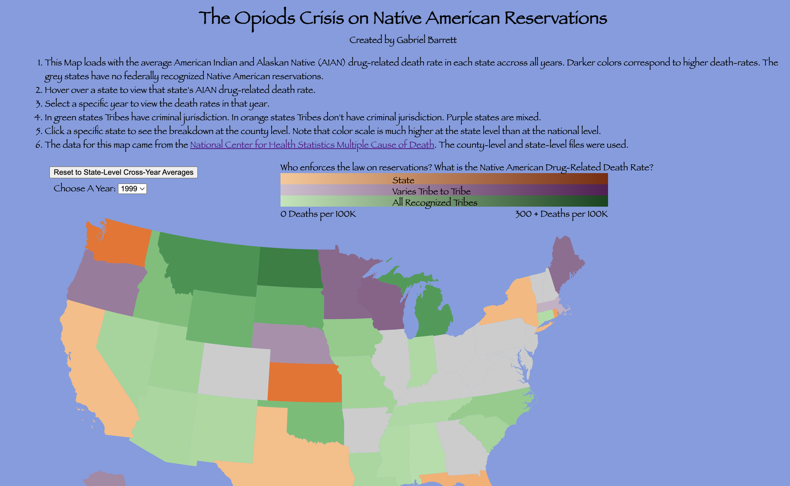

# PL280 DRD Map
Mapping AIAN drug-related death variation Across Counties and Years

Available at: https://pl280drds.netlify.app/

by Gabriel Barrett

# Project Description

This map is usable for examining variation in drug-related deaths amongs the American Indian and Alaskan
Native (AIAN) populations. It specifically explores whether drug-related deaths are higher
on Native American reservations that lack criminal jurisdiction under Public Law 280. However it
also draws attention to regional trends in the Opioids epidemic both amongst and within states. 
The first thing every user should do when opening the map is check how the death rates chagned
from 2000 to 2020.

The opening page of the map are the average drug-related death rates for American Indians and Alaskan Natives
accross all years. The user is given the option to change the year selected to any one from 1999-2020. The time
period nicely captures the growth of the opiods epidemic. Clicking on a state zooms into a county
level view of the data within that state. The default year for any state is 2020, but earlier years
can be selected. Minnesota in 2020 is the best example of the difference in death rates amongst counties where Tribes have criminal jurisdiction and where they lack it. 

# Hosted Data
The map was created using data cited below from the National Center for Health Statistics. In order
to process certain slicese of the data a flask-app, hosted at https://flask-app-bold-sound-4625.fly.dev/, is used to run a number of API queries which return certain slices of the data. The specifc queries can be explored under the flask-app directory.

# Data Sources

National Center for Health Statistics. (2022). Mortality Multiple Cause Files, 1998-2020 [Data set]. Centers for Disease Control and Prevention. https://www.cdc.gov/nchs/data_access/vitalstatsonline.htm#Mortality_Multiple

U.S. Atlas. (n.d.). States Albers 10m [TopoJSON data set]. jsDelivr. https://cdn.jsdelivr.net/npm/us-atlas@3/states-albers-10m.json

U.S. Atlas. (n.d.). Counties 10m [TopoJSON data set]. jsDelivr. https://cdn.jsdelivr.net/npm/us-atlas@3/counties-10m.json

